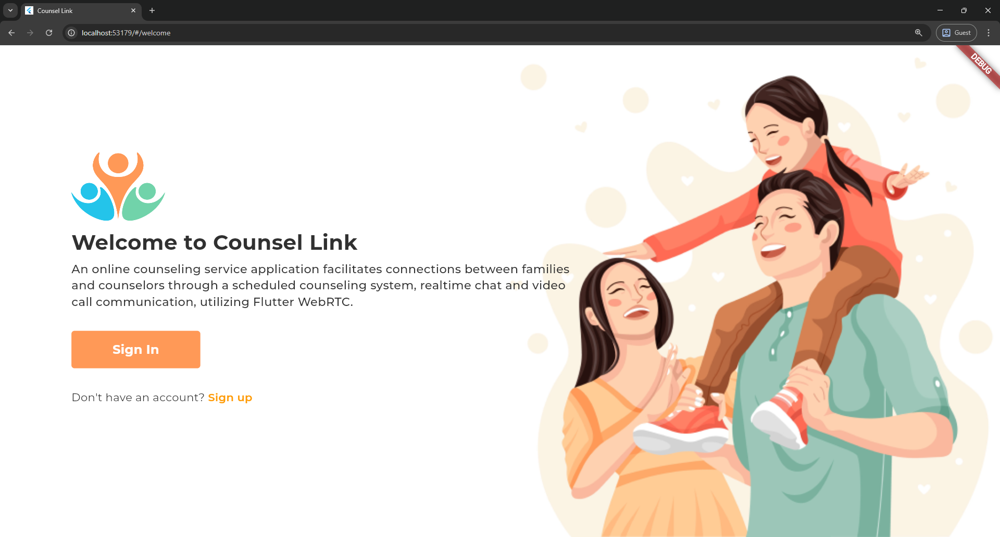
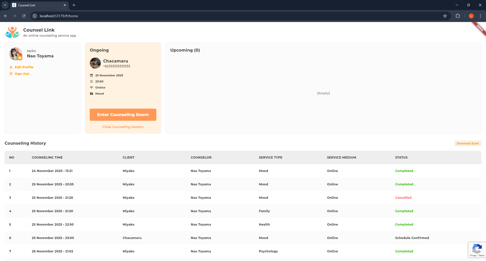
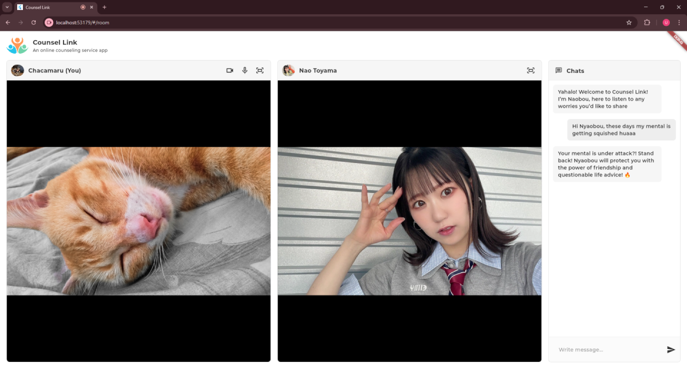
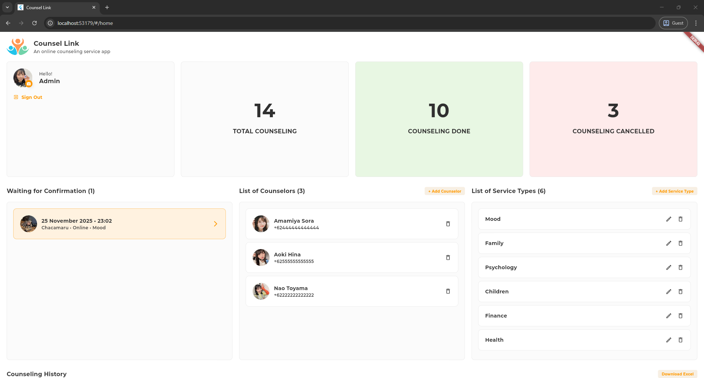
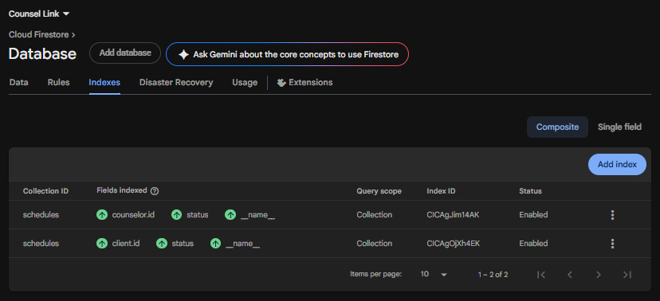

# Counsel Link

An online counseling service application facilitates connections between families and counselors through a scheduled counseling system, realtime chat and video call communication, utilizing Flutter WebRTC.

Counsel Link is an online counseling platform built with Flutter that demonstrates how to create a WebRTC application with Firebase Firestore as the signaling server. The application supports three user roles (Admin, Counselor, and Client) and provides seamless video counseling sessions with integrated real-time chat functionality.

### Application Flow

1. **Client** creates a counseling schedule
2. **Admin** reviews and confirms the schedule
3. **Counselor** receives the confirmed schedule
4. At the scheduled time:
   - Client and Counselor enter the counseling room
   - Video call session begins with chat support
5. **Counselor** closes/completes the schedule when session ends

<details>
<summary><h2>Screenshoots</h2></summary>
<br/>
<p align="left">
  
  
  
  
</p>
</details>

## What is WebRTC?

WebRTC (Web Real-Time Communication) is an open-source technology that enables peer-to-peer audio, video, and data sharing between browsers and mobile applications without requiring plugins or additional software. It facilitates peer-to-peer (P2P) connections, meaning data can be exchanged directly between users' devices without needing an intermediary server for the media streams, and allows for features like video conferencing, voice calls, and file sharing within web pages.  

### The WebRTC Connection Flow

```
Peer A                  Signaling Server                 Peer B
  |                            |                            |
  |---- Create Offer (SDP) --->|                            |
  |                            |------ Forward Offer ------>|
  |                            |                            |
  |                            |<--- Create Answer (SDP) ---|
  |<----- Forward Answer ------|                            |
  |                            |                            |
  |------ ICE Candidates ----->|------ ICE Candidates ----->|
  |<----- ICE Candidates ------|<----- ICE Candidates ------|
  |                            |                            |
  |                   [Signaling Complete]                  |
  |                            |                            |
  |<===================RTCPeerConnection===================>|
  |              (Direct P2P media streaming)               |
```

1. **Signaling Phase** (via Firebase Firestore):
   - **Offer Creation**: Client creates an SDP (Session Description Protocol) offer containing media capabilities and network information
   - **Offer Storage**: The offer is stored in Firestore
   - **Offer Retrieval**: Counselor retrieves the offer from Firestore
   - **Answer Creation**: Counselor creates an SDP answer
   - **Answer Storage**: The answer is stored back in Firestore
   - **Answer Retrieval**: Client retrieves the answer

2. **ICE Candidate Exchange**:
   - Both peers discover their network addresses using STUN servers
   - ICE (Interactive Connectivity Establishment) candidates are exchanged via Firestore
   - Candidates contain possible connection paths between peers

3. **Connection Establishment**:
   - Peers attempt to connect using the exchanged ICE candidates
   - The best connection path is selected (direct P2P if possible)
   - If direct connection fails, traffic is relayed through TURN servers

4. **Media Streaming**:
   - Once connected, audio/video streams flow directly between peers
   - Low latency communication is achieved through P2P connection

### Why Firebase Firestore as Signaling Server?

In this application, Firebase Firestore serves as the signaling server because:
- Real-time listeners detect changes instantly
- No need for custom WebSocket server implementation
- Built-in authentication and security rules
- Easy integration with Flutter

The signaling process stores offer/answer SDPs and ICE candidates in Firestore documents, which both peers listen to for establishing the WebRTC connection.

### Limitations

- May not work using VPN
- Connection quality depends on network stability
- Different implementations across platforms may cause issues
- Some older devices may not support WebRTC features
- Mobile browsers may have limited functionality

## Setup Instructions

### Prerequisites

- [Flutter SDK](https://flutter.dev/docs/get-started/install) (latest stable version)
- Firebase account
- Google Chrome

### 1. Firebase Project Setup

- Create a new project on [Firebase](https://firebase.google.com/).
- Follow the instructions to add Firebase to your Flutter app [here](https://firebase.google.com/docs/flutter/setup).
- Enable phone authentication provider
- Update cloud firestore rules to allow read write operation

```
service cloud.firestore {
  match /databases/{database}/documents {
    match /{document=**} {
      allow write: if request.auth != null;
    }
    match /users/{document=**} {
      allow read;
    }
  }
}
```

- Add cloud firestore indexes to enable query




- Update firebase storage rules to allow read write operation

```
service firebase.storage {
  match /b/{bucket}/o {
    match /{allPaths=**} {
      allow read, write: if request.auth != null;
    }
  }
}
```

### 2. Enable Phone Authentication

#### Step 1: Enable Phone Sign-In Method
1. Go to Firebase Console
2. Navigate to **Authentication** > **Sign-in method**
3. Click on **Phone** provider
4. Click **Enable** toggle
5. Click **Save**

#### Step 2: Add Test Phone Numbers
1. In the same **Sign-in method** page, scroll down to **Phone numbers for testing**
2. Click **Add phone number**
3. Add test phone numbers and verification codes

### 3. Create Admin User

Admin users must be created manually. Counselors can be created through the admin dashboard, and clients can sign up directly through the app.

1. Go to Firebase Console
2. Navigate to **Firestore Database**
3. Click **Start collection**
4. Collection ID: `users`
5. Click **Next**
6. Click **Add document**
7. Use **Auto-ID** or enter custom ID
8. Add fields:

```json
{
  "id": "admin001",
  "name": "Admin User",
  "phone": "+62111111111111", 
  "role": "admin",
  "createdAt": "2025-01-15T10:00:00Z",
}
```

## Installation

1. **Clone the repository:**
    ```sh
    git clone https://github.com/elrizwiraswara/counsel_link.git
    cd counsel_link
    ```

2. **Install dependencies:**
    ```sh
    flutter pub get
    ```


4. **Run the application:**
    ```sh
    flutter run -d chrome
    ```
    or
    ```sh
    flutter run -d web-server
    ```

## Contributing

Contributions are welcome! Please open an issue or submit a pull request for any bugs, feature requests, or improvements.

## License

This project is licensed under the MIT License - see the [LICENSE](LICENSE) file for details.